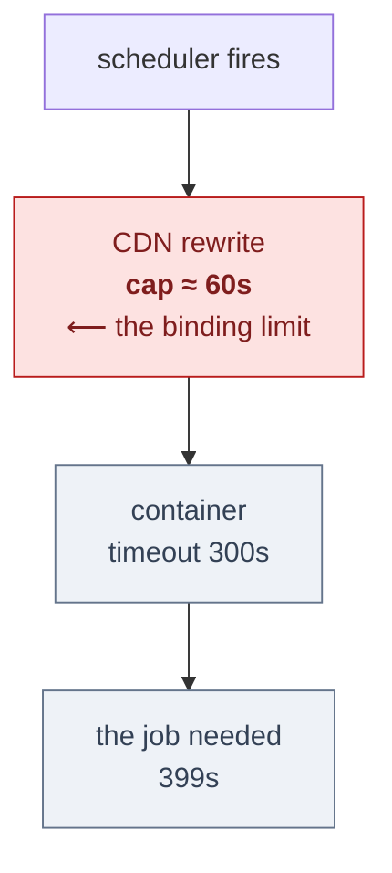

# Running a production web app on nothing

*Shubh Bhagya — a Vedic astrology site at [shubhagya.com](https://shubhagya.com),
where "everything runs on free tiers" is an architectural constraint rather than
a temporary stage.*

FastAPI and Jinja2, server-rendered with HTMX for partial updates. No SPA, no JS
build step. Roughly 21,600 lines of Python across 30 modules, 68 routes, 76
long-form articles, 11 LLM prompt templates and 11 knowledge files.

**Running cost: the domain, about ₹1,700 (~US$20) a year. Nothing else.**
Container hosting, object storage, CDN, scheduling and model inference all sit
inside free tiers. Not a trial, not a credit — the steady state.

Every number below is measured, and most were paid for in other ways.

---

## The constraint

Free tiers do not fail gracefully. They impose hard, oddly-shaped limits, and the
shapes are what drive the design:

- **The container scales to zero.** Cold starts are accepted as the price of a
  zero floor. Nothing may assume a warm process.
- **Three scheduled-job slots. All three used.** New scheduled work must replace
  something, not add to it.
- **Object storage is free in one region only** — and it is not the region the
  application runs in.

That last one is the clearest example of a free tier bending architecture. The
app runs close to its users in South Asia; the bucket sits on another continent
because that is where the free tier lives. Every bucket round-trip pays
intercontinental latency, permanently, by design.

This has been reconsidered and rejected more than once. Moving the bucket costs
money; paying the latency costs none. The correct move is not to relocate the
bucket but to **stop making round-trips**.

## Six cache layers, and the one that matters

| Layer | Scope | Survives restart? |
|---|---|---|
| In-process TTL cache | one container | no |
| `lru_cache` (stdlib) | one container | no |
| Per-computation dicts | one container | no |
| File cache on the instance | one container | no |
| SQLite database file | one container | no |
| Object storage | **shared** | **yes** |

The layer most likely to fool you is the one that looks like a database.
Per-chart model output lives in SQLite — on a memory-backed filesystem. It has a
schema and transactions, and it evaporates with the container. *Is it
persistent?* is not answered by *is it a database?*

Only the last row is real persistence. Everything above it dies with the
container — and with a zero floor, containers come and go constantly.

That single fact governs the whole design: **if two requests must share a
result, object storage is the only thing that gets them there.** In-process
caching is a latency optimisation, never a correctness mechanism. Design
anything else and it works perfectly on your laptop, where one warm process
serves every request, then fails in production where containers come and go.

The escape hatch is a warming job: a scheduled request generates the expensive
content and writes it to shared storage, so the first real visitor of the day
reads rather than generates.

## The incident that shaped the caching rules

The homepage once took **~13 seconds** to render. The cause was not slow
computation — it was roughly **30 sequential object-storage round-trips per
render**, each paying that intercontinental latency, serially.

The fix was to remove them, not to speed them up: **32 storage operations → 0**
on that path. The render path now costs about **1 millisecond warm** — a
performance gate measures it, so the regression cannot come back quietly — and
end to end the page went from ~13 seconds to under a second.

**The generalisable rule:** never put a network round-trip on a hot path. Not a
fast one, not a cached one. The latency was always there; what made it a
13-second page was doing it thirty times in sequence.

## Cost control in the LLM layer

The model spend is the one cost that scales with traffic, so it gets the most
attention.

**Bound the reasoning.** Setting reasoning effort to its lowest setting cut
completion tokens from **~3,072 to ~302** — and *increased* the amount of
visible answer. The tokens were being spent thinking, not answering. This is the
single highest-leverage cost change in the system, and it cost nothing in output
length to make.

**Probe capability at runtime; never hardcode model lists.** A model that
rejects the parameter is remembered and retried without it. Hardcoded lists go
stale — two chain entries once pointed at decommissioned models for days.

**One model was excluded for being unboundable.** It rejects the effort
parameter outright, so it reasons until it hits its completion limit, gets
truncated mid-thought, and the output sanitiser then strips it to *zero visible
characters*. A 40-second call returning nothing. Measured end to end: the daily
two-language job took **399 seconds** with it in the chain and **213 seconds**
without. Removing a model nearly halved the job.

**Quotas are keyed per model, not per key.** Listing several genuinely distinct
models multiplies throughput on one API key; listing two aliases of the *same*
model does not — they share one bucket while looking like extra capacity. Free
tiers reward reading the quota documentation carefully.

**An empty completion is an error, not an answer.** The client raises rather
than returning an empty string. Before that, a reasoning-only response was
indistinguishable from success — and got cached blank for the entire day. A
silent wrong answer is far more expensive than a loud failure.

## Making prompts cacheable

Most of a daily-horoscope prompt repeats across all twelve signs. But *shared*
is not *cacheable*: a prefix cache needs the shared bytes contiguous from
position zero, and the per-sign anchor led the message — so the twelve calls
diverged **28 characters in**.

Measured: **9,963 of 13,482 characters (73.9%)** shared, with a 3,519-character
unique tail. Moving the shared blocks ahead of the anchor took it to **12,800 of
13,310 (96.2%)**, unique tail 510.

```text
                shared prefix                         unique tail
before  ██████████████████████████████░░░░░░░░░░      73.9%   3,519 chars
after   ██████████████████████████████████████░░      96.2%     510 chars
        └─ diverged 28 chars in ─┘
```

Same content, same total length. The only change was moving the shared blocks
ahead of the per-sign anchor.

Worth being honest about the payoff: the provider's prefix caching is
opportunistic, and measured **one hit in six**. The reordering buys nothing on
its own. It gives the cache something to hit when it chooses to — cheap
insurance, not a guarantee.

## Cache keys must cover the logic, not just the inputs

LLM output is keyed by a fingerprint of the user's inputs *and* a fingerprint of
the prompt. The prompt fingerprint hashes the prompt file — but a file hash
cannot see changes to the code that *assembles* the message around it.

So there is an explicit version constant, bumped by hand whenever assembly logic
changes. It is a manual step, which is a smell, but the alternative is worse:
edit the assembly code, ship it, and serve yesterday's cached output from a
prompt that no longer exists.

**The general point:** a cache key must cover everything that can change the
output. Inputs are the obvious part; the code path is the part people miss.

## The 60-second ceiling that belonged to the other layer

The daily email broke for **21 days** and was misdiagnosed twice.

The container's request timeout was raised — a true diagnosis of a real limit,
and the failure continued. The actual ceiling was in the CDN layer in front of
it, which caps a rewrite to the backend at about 60 seconds regardless of what
the backend permits. The lower limit wins, and it was owned by a component
nobody was looking at.



Three limits on one request path. The container's 300s was raised and re-raised;
the job needed 399s. Neither mattered, because the smallest cap in the chain
belonged to a layer nobody was inspecting.

Two lessons, and the second is the expensive one:

1. **In a layered stack, the effective timeout is the minimum across all layers**,
   and it is rarely the one in your own configuration file.
2. **The failure was silent.** A daily job that stops producing looks exactly
   like a quiet day. Nothing threw, so nothing was there to catch — twenty-one
   days is how long that lasted before a human noticed the absence.

**What fixed it** was two changes, and the second is the better lesson. The
scheduler now calls the backend directly, bypassing the layer that owned the
lower cap. More durably, the job was restructured so no single request needs a
long timeout at all: one 399-second request became a warm step and a send step
of 83s and 130s. Rather than fight for a longer ceiling, arrange not to need one.

Relatedly, retries on the scheduled jobs are deliberately **off**: they were
double-generating readings and doubling model spend. On a free tier, a retry
storm is not a resilience feature, it is a bill.

## A guard that does not guard reads as an assurance

The test suite's docstring claimed it needed no network and no API key. Nothing
*enforced* that claim, and over time nine tests drifted into making real network
calls while five more depended on a live key.

The result: a clean checkout produced **14 failures that were not defects**.
Every person and every agent that touched the repo had to diagnose a red suite
before being told to work around it.

The fix was two fixtures that make the claim true by construction. The cut was
kept deliberately narrow — the real astronomical computation still runs, so the
assertions still mean something; only the single outbound call is stubbed.

One detail worth copying: the fixture **overrides** a real API key rather than
supplying one when absent. A developer with live credentials cannot have a
forgotten stub quietly spend paid quota.

**The lesson generalises well beyond tests:** a rule that lives only in prose is
not a rule. If it matters, something has to enforce it — otherwise it decays
into a false assurance, which is worse than no assurance at all.

## What I'd do differently

- **Absence is a failure mode, and exception alerting cannot see it.** Error
  alerting would never have caught the outage: nothing threw. Schedule-driven
  work needs a check keyed to *did output appear*, which is a different mechanism
  from error alerting rather than a tuning of it.
- **Make the cache-version bump automatic.** Hashing the assembly module
  alongside the prompt file would remove the manual step and the class of bug it
  exists to prevent.
- **Codify the region trade-off in one place.** The cross-continent bucket is
  correct but surprising, and it has been re-litigated more than once. A decision
  record costs less than the third rediscovery.

## Summary

| Concern | Approach |
|---|---|
| Zero budget | Free tiers treated as permanent constraints that shape design |
| Scale to zero | Only shared storage is real state; in-process caches are latency only |
| Latency | No network round-trips on hot paths — 32 operations to 0, ~13s to under 1s |
| Model cost | Bounded reasoning (~3,072 → ~302 tokens), runtime probing, per-model quotas |
| Correctness | Empty completion is an error; cache keys cover code, not just inputs |
| Reliability | The effective timeout is the minimum across layers; watch for absence |
