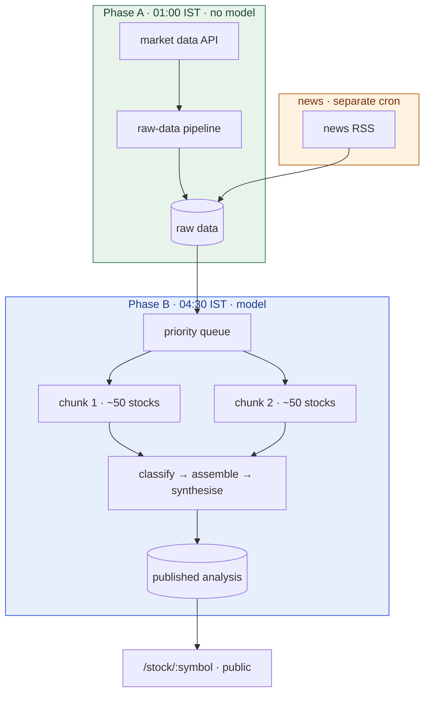
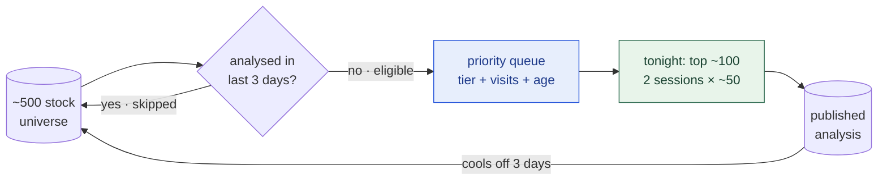

# Keeping 500 stocks analysed on 100 LLM runs a night

*VivaTrades — a batch pipeline that refreshes research reports for the NIFTY 500,
rotating the full universe every five days.*

Fundamentals, technicals, news, sector position, peer ranking, risk flags and a
synthesised narrative, for ~500 NSE-listed stocks. Built and operated by one
person.

Every number below is a configured value or a measurement from the source.

---

## The constraint that shapes everything

**Running cost: the domain, about ₹1,700 (~US$20) a year.** There is no cloud
bill at all. The pipeline runs on a machine I already own, and the model spend
sits inside a **flat-rate coding subscription with a rolling usage cap** — the
same subscription used to write the code is what runs the nightly synthesis.

That is a stranger constraint than a budget, and a more interesting one: there
is no "pay for more" lever. You cannot buy your way past a rolling cap the way
you can buy a bigger instance. When the ceiling is fixed, the only remaining
moves are to *need less* — do less work, do it more cheaply, or do it with code
instead of a model.

Nearly every decision below follows from that.

## Shape of the solution

## Decision 1 — separate cheap work from expensive work

Fetching data is cheap, rate-limited and fails often. Model synthesis is
expensive and only worth doing on fresh data. Fuse them and a rate-limit error
on stock 340 has already wasted the model spend on stocks 1–339.

So they are two jobs, three and a half hours apart, writing to two tables.

| | Phase A | Phase B |
|---|---|---|
| Runs | 01:00 IST | 04:30 IST |
| Covers | all ~500 | ~100 by priority |
| Model cost | **none** | the entire budget |

Phase A is idempotent and safely re-runnable; Phase B always reads a table that
is already populated. A Phase A failure degrades freshness rather than breaking
the run.

**The same principle got applied twice.** News originally came in with the rest
of Phase A. RSS slowness cascaded and stretched that pipeline from ~10 minutes
to **7 hours**, so news moved into its own cron. Phase A now fetches three
sections; news arrives on its own schedule.

The rule generalises: **a slow, flaky dependency should not share a failure
domain with a fast, reliable one.** It will set the pace for everything it
touches.

## Decision 2 — cover 500 stocks with 100 model runs

Phase B processes ~100 stocks by priority, not all 500. Priority combines a tier
weight, a recency-of-visit bonus and an age boost, with a **3-day freshness
skip** so a recently-analysed stock drops out of contention. The queue rotates
the full universe in roughly **five days** on a fifth of the nightly spend.

The cycle is the whole mechanism: analysed stocks cool off, the rest compete on
priority, and the top ~100 run tonight.

That skip is load-bearing. Remove it and the same large caps get re-analysed
nightly while the tail is never touched — the system looks busy and quietly
covers a tenth of its universe.

**An honest tension.** With a 3-day skip, appreciably more stocks become
eligible each night than there are slots. The freshness the skip *implies* is
one the throughput cannot actually deliver. Rather than paper over that, every
read returns an age and a staleness flag, and the UI surfaces per-section
freshness. A reader can see the data is four days old and judge accordingly.
Making the gap visible is a better product than a promise that quietly fails.

## Decision 3 — don't use a model where code will do

Phase B is a chain with three different requirements:

| Step | Runs on | Why |
|---|---|---|
| News classification | Cheap fast model | High volume, low judgement |
| Section assembly | **Deterministic TypeScript** | No model at all |
| Risk + synthesis | Capable model | The one step needing judgement |

The middle row matters most. Four sections — fundamental, technical, news,
sector — are assembled by ordinary code from data already fetched. No judgement
is involved, so no model is used.

A model asked to restate a P/E ratio will occasionally restate it *wrong*.
Deterministic assembly makes a whole category of error impossible rather than
merely unlikely, and it costs nothing against the cap.

**The rule:** use the model where judgement is genuinely required, and nowhere
else. That single principle did more for cost and correctness than any prompt
engineering.

## Decision 4 — an agent orchestrator, guarded by a row count

Phase B is orchestrated by coding-agent sessions invoked from cron, with a
sub-agent per analysis dimension and a synthesiser composing the result. Adding
a dimension is a prompt and a schema rather than a service.

The cost is that an agent's failure mode is **not a stack trace**. It is a run
that completes, reports success, and writes less than it should. One night's log
records an agent concluding *"Monitor timeout is fine"* — and exiting **0**.

Two mitigations, both shaped by that.

**Don't trust the exit code.** After the run, the wrapper queries the database
and asserts a minimum number of analyses were actually written that day. Fewer
rows than the floor is a failure regardless of what the process reported.

**Split the run so a crash costs half, not everything.** Rather than one long
session over ~100 stocks, it runs as two independent sessions of ~50. Long agent
sessions die — a dropped API socket kills the whole session — and a fresh
session gets a fresh socket. Measured, this drops the probability of a
zero-coverage night from **~30% to ~5–10%**. Expected delivery becomes ~100
stocks when both succeed and ~50 when one dies, instead of all-or-nothing.

**Generalisable point:** when a component can fail by doing *less* rather than
by erroring, the health check must measure **output**, not process status — and
independent retries beat one long attempt when failure is per-session.

## Decision 5 — keep the personal side out of production entirely

The application has two halves: a public one serving stock analysis, and a
private one for the operator's own portfolio and strategy testing.

Rather than protect the private half with authorisation alone, it is excluded
from the production deployment. Middleware detects the hosting environment and
returns 404 for every admin path **before any route handler runs**, so the
production database is never touched by that code. Those routes exist only
locally, behind a separate check.

**Why this over role-based access:** an auth bug in a single-operator system is
a total compromise, and the personal half has no reason to exist in production.
Making the code unreachable is a stronger guarantee than making it protected,
and it bounds the blast radius of any future mistake to a laptop.

## Decision 6 — the timeout I got badly wrong

Phase A fans out with bounded concurrency and one retry. Concurrency was raised
from 8 to 12 after measuring the upstream's tolerance. That part went fine.

The per-stock timeout did not.

I set it to **45 seconds**, reasoning about the happy path. The upstream's
*ordinary slow-night* per-stock time is 50–90 seconds — sitting just above the
cap. For five consecutive nights the timeout fired on **477–485 of ~500 stocks**.
The pipeline reported itself healthy while destroying roughly 95% of nightly
coverage.

It is now **180 seconds**: worst case ~2.1 hours, typical run ~10 minutes,
against a 3.5-hour window before Phase B.

**Two lessons, and the second is the one I actually paid for:**

1. **Set a timeout from the tail of the observed distribution, not the median.**
   A cap tuned to the happy path is not a safety valve; it is a scheduled outage.
2. **Confirm what a timeout fires on before trusting it.** The failure was
   invisible from the outside — the job completed, on time, every night.

## What actually broke

**The 45-second cap**, above. The most expensive configuration change I have made.

**A stale-draft bug.** The assembly stage wrote to an existing draft row without
refreshing its run date, so a downstream stage saw a row that looked current but
wasn't, and balked. The run recovered that night via a throwaway script. The
proper fix — an upsert that always bumps the timestamp — is identified and
**not yet shipped**. The lesson stands regardless: "row exists" and "row is from
this run" are different questions, and a stage that conflates them fails
intermittently and confusingly.

**Two databases, one mental model.** Cron writes to the hosted database; local
development reads a local one. Debugging a cron problem against local data
produces confident wrong conclusions. The fix was operational: the cron log now
states which host it wrote to.

## What I'd do differently

- **Cancel abandoned work, don't just stop waiting for it.** When the per-stock
  race resolves, the losing in-flight fetches are not cancelled. Hundreds of
  background HTTP calls accumulate each night and *compound* the upstream
  throttling the timeout exists to relieve. A timeout that abandons work without
  cancelling it makes the problem it was added to solve worse. This is still
  open.
- **Make the output floor per-tier.** A single minimum-rows check passes if 100
  large caps succeed and every small cap fails. Per-tier floors would catch the
  partial failure the aggregate hides.
- **Version the intermediate table.** Phase A and Phase B are deployed together
  but conceptually decoupled; a schema version would let Phase B reject rows it
  doesn't understand rather than misread them.

## Summary

| Concern | Approach |
|---|---|
| Fixed spend ceiling | Phase split, deterministic assembly, priority rotation |
| Coverage | Freshness skip rotates ~500 stocks through 100 nightly slots in ~5 days |
| Correctness | No model where code suffices; output-count guard, not exit codes |
| Staleness | Made explicit — age and stale flags surfaced to the reader |
| Agent fragility | Two independent sessions: zero-coverage risk ~30% → ~5–10% |
| Blast radius | Personal half unreachable in production, not merely protected |

None of this is exotic. It is mostly the discipline of asking, at each step,
whether a model is required — and being willing to answer no.
